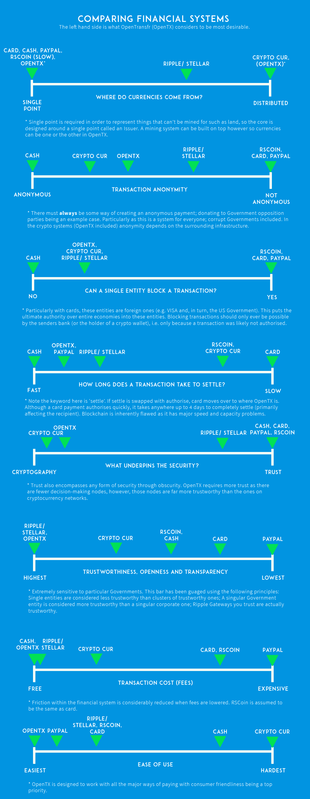

.. _comparisons:

Comparisons
===========

In order to make sure the designs are most suitable, it helps to compare them with other systems on a collection of desirable properties. The current approximate standing of OpenTransfr is as follows:

Essentially, the goal is to keep pushing towards the left (most desirable) of these charts, with a key exception of anonymity where OpenTransfr will intentionally take a middle ground. The payment network is anonymous, but the surrounding infrastructure is likely not.