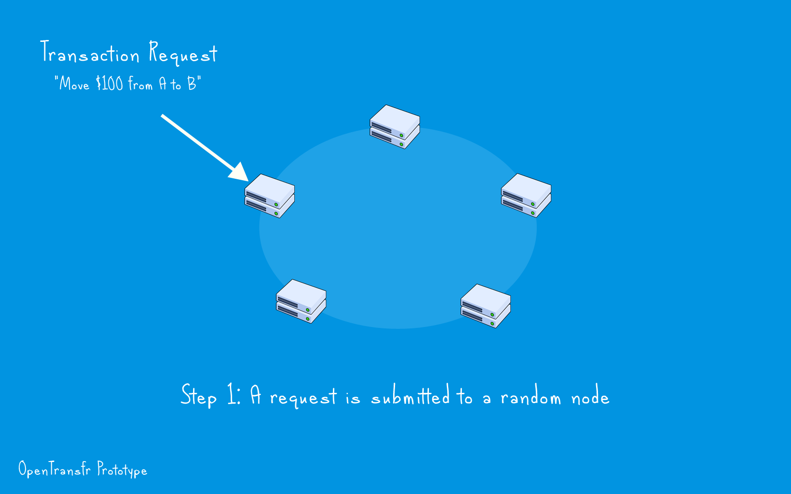

.. _consensus:

How consensus works
===================

When a transaction is processed, everybody has to agree that it's valid. That involves checking that the request came from the owner as well as checking if there's enough funds available. The process behind a group of nodes collectively agreeing about a transaction is called consensus. With OpenTransfr, reaching consensus is simple and works like this:

In 2 phases, which can be potentially grouped up with other transactions, consensus is achieved. This mechanism is primarily applied to transactions, however it's also used when, for example, a company updates its information.

As these phases are just two parallel groups of HTTPS requests, consensus can be obtained well within 2 seconds.

Double Spending
---------------

Double spending can be summarised as any attempt to spend value twice, like this:

.. image:: images/D1-Request.png

Double spending is prevented by using locking. During the first phase when a node agrees that a transaction is valid, it puts the amount aside. When it receives a successful majority in the second phase, it then 'commits' the amount.
