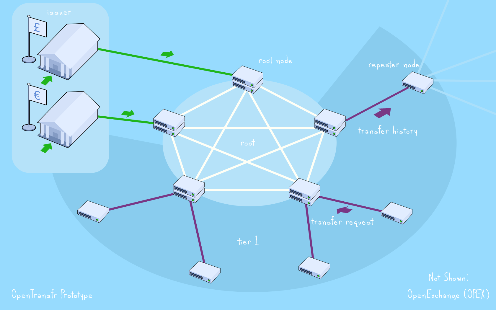
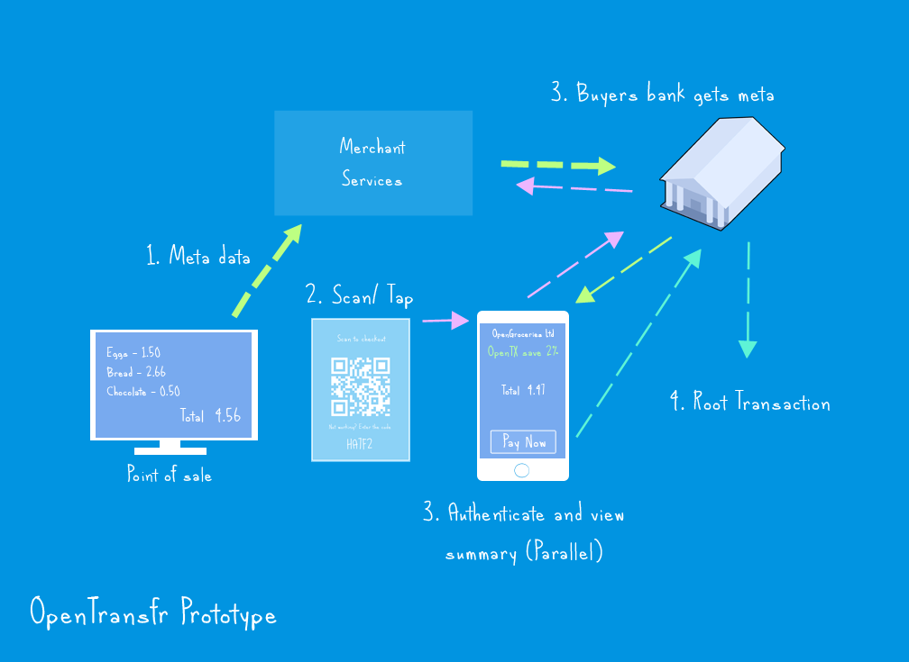
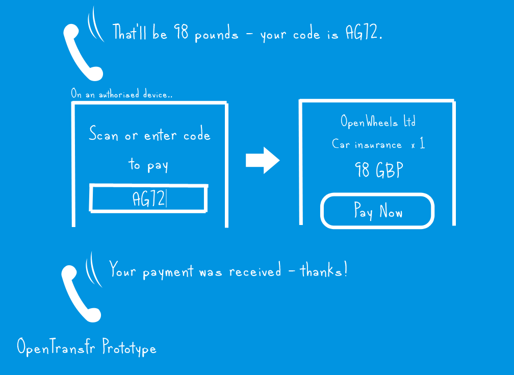

Welcome to the OpenTransfr network documentation!
=================================================

This documentation describes the structure of all parts of the network in depth. Please note that it is very much a work in progress and the design will regularly change during this process until it is marked as stable.

.. contents:: Table of Contents
   :local:

.. toctree::
   Components

.. _overview:

What is OpenTransfr?
--------------------

OpenTransfr is a design for a payment system built to handle currencies and commodities that you see and use everyday such as the Pound Sterling or the US dollar. Its primary goals are to be free, fast and open to everyone to allow as much innovation as possible in the financial sector. This system takes concepts from cryptocurrency networks and combines them with traditional systems to create a hybrid that works for everyone. This brings up two questions - why do we need new transaction systems, and what's wrong with cryptocurrencies?

Why do we need a new system?
----------------------------

- Bank fees, transaction fees and exchange fees are excessively expensive
- Existing payment networks are too centralised, putting too much power in one place
- It's difficult to change from one bank to another
- Extremely limited information in the existing banking system on e.g. what has been purchased and where from
- As a consumer, I have no idea who currently holds my card details. This creates security problems, plus..
- It’s difficult to know what payments will actually be leaving your bank account and when
- Too much trust is placed with merchants in dealing with card details, e.g. providing them over the phone is a major security risk. This creates hassle for merchants as they have to deal with extra security measures and makes them large targets for people who want to steal lucrative card details.

Why not use cryptocurrencies out of the box?
--------------------------------------------

First and foremost, cryptocurrencies have changed everything. Their existing setup can just be considered version 1 in an ever evolving financial system. In case you haven't been following, Bitcoin is having some extremely widespread problems. Here's just a few of them:

- It was built under the assumption that no-one will gain a 'majority', however, a Chinese-lead group has managed to do exactly that.
- Anyone who holds a majority (or creates a powerful computer to instantly get a majority) can overtake the blockchain and entirely replace it with fake information.
- The currency itself is extremely volatile
- Shrouded in legal problems because of a total lack of regulation. As a result, Banks and Governments strongly dislike it.
- Blockchain systems waste far too much energy
- Addresses look too complicated for consumers
- People keep losing their private keys and as a result, permanently loosing access to their value.
- Blockchain has fundamentally slow transaction speeds. A Bitcoin transaction can take anywhere from 10 minutes to a whole day as the network throughput is seemingly maxing out at 1 transaction per second.
- Current cryptocurrency systems essentially completely fail to scale, particularly where high latency links are introduced as the entire network is impacted.

For more information, there's an excellent blog by a previous Bitcoin developer here: https://medium.com/@octskyward/the-resolution-of-the-bitcoin-experiment-dabb30201f7#.7tweula3q

How can we fix it?
------------------

Here's the process that got the design of OpenTransfr to where it is today:

- Cryptocurrencies have a lot of excellent properties which must be kept. The security, the transparency and the anonymity are mostly ideal. So, we start from a cryptocurrency design and build up from there.
- Blockchain has failed, so let's remove that.
- The consensus system has failed too, so we'll replace that as well.
- The network needs to work for everyone, so we want some regulation, but not too much (we don't want Governments to see everything you bought, for example, but we do want them to have something against things like criminal activity), and it has to be trustworthy. The network must be allowed to grow and evolve as new and exciting ideas appear.
- Abstract off addresses with a much friendlier username.
- It needs to be a singular network that can transfer anything so it can work with all existing commodities.
- If there's no blockchain then we'll need a new way of introducing value into the network, plus a new way of reaching consensus.
- Merchants must never have to deal with any form of card details; instead, all payments should be 'pushed'.

Structure Overview
------------------

Now we've got some of the baseline requirements, the major aspects of the system are summarised as follows:

- A tiered system. The very top tier, called the root, is the most trusted part of the network. There can be more than one root, each grouped together based primarily on latency between the nodes. It's their job to authorise transactions. Everyone connects up to the root to collect information and submit requests, optionally forming new tiers of servers around the root to help spread load. Everything root does is publically visible and verifiable by anyone.
- Individual organisations in the root, each called a root node, hold a single 'vote' each. It doesn't matter how much computing power they have.
- A majority of root nodes must all agree that a transaction is valid for it to go through. See the consensus mechanism for how they do that.
- Tiers plus majority voting is what makes it a hybrid of centralised and distributed. This is considered most favourable because distributed systems have a habit of becoming centralised (think GitHub and Bitcoin itself), so it might as well be a trusted 'best of both'.
- An organisation can become a root node if they are regulated by a recognised regulator in the root and submit a request to the root. We call this ascension and it's not required for a company to be able to send/ receive payments.
- The root tracks current balances in all the known addresses. Addresses are anonymous and are the public keys of public-private key pairs.
- Banks, known and trusted ones, store the set of private keys.
- A username is related to a particular bank. A sender asks a bank for a new address for a given username then performs a transaction.
- A transaction states which address value is coming from and which it is going to. It's signed using the sender's private key.
- Value enters the network when an issuer 'issues' it onto the network. For currencies, this would be a central bank role. For example, a central bank could receive its currency over a traditional transaction, and then issue the same amount onto the network.
- There's only ever one issuer per commodity. This prevents any form of 'one pound/euro/dollar etc being worth more than another'. The Central Bank of a currency is intended to fulfil this role.
- As the network handles multiple types of commodity, it has an exchange to swap one for another.
- Everything will always be what we'll call a 'push' transaction; that's where the consumer is always sending value out of their account (either manually or as a result of a 'subscription'), rather than it being 'pulled' out by a merchant. This way the consumer can always see and know exactly what is going out of their bank and when, and cut something off without having to go through the existing major hassle of cancelling a card. Plus, merchants don't need to worry about security problems in order to take payments.
- All payments will have much more metadata, known only by the user's bank, allowing analysis and categorisation to be trivial. This would make things like tax payments entirely automatable.
- Banks share a common API allowing users to setup subscriptions, perform payments, list history etc.

The end results of the above are a network which is trustworthy, open, more secure than existing systems, distributed yet able to scale (because root is intended to be small groups of organisations and scaling problems would otherwise happen with the 'majority consensus' aspect) and built on a cryptographic guarantee.

For more detail on individual components, such as roots, issuers or commodities etc, see their related documentation.

Following a payment from end to end
-----------------------------------

In order to help better understand how the system actually works, let's describe the full chain of events that occurs when someone makes a typical payment in a bricks and mortar store, grouped up by the type of entity that is involved:

**Issuer**:

1. At some point in the past, a currency is spontaneously created on the network by its issuer. The issuer is usually a Central Bank.
2. The issuer then would typically swap the cryptographic version of their currency for the traditional one with a Bank. How they approach this entirely depends on the issuer's policies.
3. Banks now have reserves of the cryptocurrency form. They can internally manage these reserves as they wish (i.e. in essentially the same way they already do).

**Merchant Services**:

4. A user who has a bank account capable of using this system arrives at a checkout and wishes to pay. The checkout has a globally unique ID which is represented as a short textual code.
5. The merchant scans the products like normal and then upload the information to a merchant service, relating it to the checkout ID.
6. The consumers device (intended to be, but not limited to, a smartphone) obtains the checkout code and forwards it to their bank.

*Note: The current reference implementation uses QR codes for stage 6; it is by no means limited to that however.*

**Consumers Bank**:

7. The consumer authenticates with the device (e.g. a pin or biometrics), decrypting a private key. The device authenticates with the bank using a signature made with the private key.
8. The consumer's bank obtains the checkout information from the merchant services using the checkout code, essentially acting as a digital receipt. The merchant services also send the merchant's username along with checkout information to the receiving bank and in response gets a new address to send the payment to.
9. The consumer's bank displays the total to pay to the consumer.
10. The consumer accepts it and, provided they have enough funds, the bank submits the payment to the root it's in.

*Note: 7,8 and 9 all occur mostly in parallel*.

**Root**:

11. Consensus occurs. The receiving root node forwards the request to other roots, they each sign it, and the signature collection is then sent to all root nodes and tested for majority.
12. Provided consensus was reached, a payment to the address is broadcast out of the root. The bank and the user's device are informed simply by the response.

*Note: 11 can occur in bulky batches with many other transactions*.
*Note: Root nodes are operated by Banks and allowed in by a regulator*.
*Note: 11 can occur twice if the transaction goes between two different roots (the sending root then the receiving root both form majorities)*.

**Receiving Bank**:

13. The receiving bank, as well as the merchant services, know which payment the address relates to (due to stage 8).
14. Merchant services inform the checkout of the successful payment. Transaction complete!

Online? Over the phone?
-----------------------

They work in mostly the same way. The checkout code is simply allocated differently:

- Online it's dynamically created essentially acting just like a hosted shopping cart.

- Over the phone, the operator gets a specialised short form checkout code (typically averaging just 3 characters long) and speaks it to the consumer, who then either writes it down to pay later, or enters it into a device they can pay with.

Repeat charging
---------------

As payments are always 'pushed', companies lose the ability to charge consumers unknown amounts at seemingly random times. This is replaced with subscriptions; essentially the equivalent of having a standard API for creating standing orders which can vary in value and occur at relatively complex intervals. Most importantly, they are always known by your bank. Goodbye horrific credit card data leaks and hello payment certainty.

Reference Implementations
-------------------------

The 5 major components (Bank, Root, Merchant, Issuer, Regulator) have in progress implementations at the following locations; each has a friendly UI which uses their API (which is at, for example, https://bank.opentrans.fr/v1/).

- https://bank.opentrans.fr/. OpenBank; an example of a bank with OpenTransfr capabilities.
- https://txroot.opentrans.fr/. OpenTransfr root node; an example of a root node on the network.
- https://pay.opentrans.fr/. OpenPay Merchant Services; an example of a merchant service which accepts payments on the network.
- https://issuer.opentrans.fr/. OpenIssuer; an example of a commodity issuer (typically a Central Bank role).
- https://regulator.opentrans.fr/. Regulator; an example of a regulator which essentially defines a new root.

'Free'?
-------

OpenTransfr itself does not charge any fees or define any form of interchange fee. However, many banks may need time to adjust to a different revenue system, so:

- Merchant prices almost always include the transaction fees that they pay. So, it's recommended for merchants to provide a small discount for users paying using this network. The merchant still saves money as they don't need any form of monthly payments to a gateway service or any form of custom hardware.
- The sending bank is able to charge a self-defined fee if they wish, although it's not recommended. These fees can only be defined as a % with a set limit which rounds down. For example, "0.12% up to £1". This fee is taken out of the discount.
- From the consumer's point of view, they see a discount of approximately 2% by using this system.

Traditionally, security is the main reason given for fees. As this network is based upon cryptocurrencies and card details never pass through a merchant, the security aspect is a non-issue.

By dropping the network fees to zero, a considerable amount of friction is removed from the financial system allowing banks to directly compete with each other and, ideally, get their self-defined fee down to zero too. As the transaction volume and bank reserves would be notably higher (i.e. as less people are physically withdrawing cash and moving it in person) banks would be able to quite easily replace that revenue stream through increasing their more traditional investment/ loan stream. In summary, more control to everyone in an economy that's moving faster than ever.