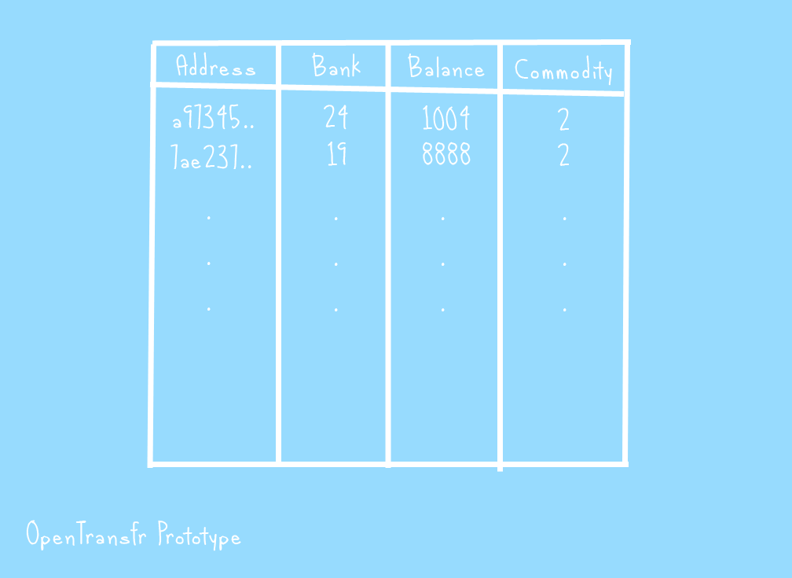
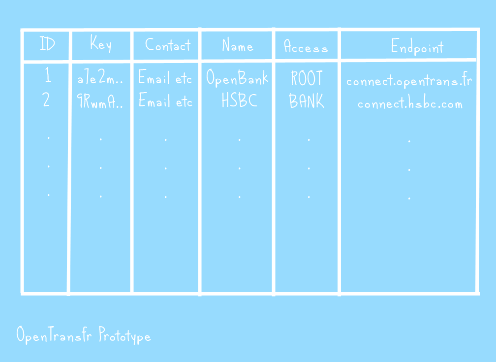
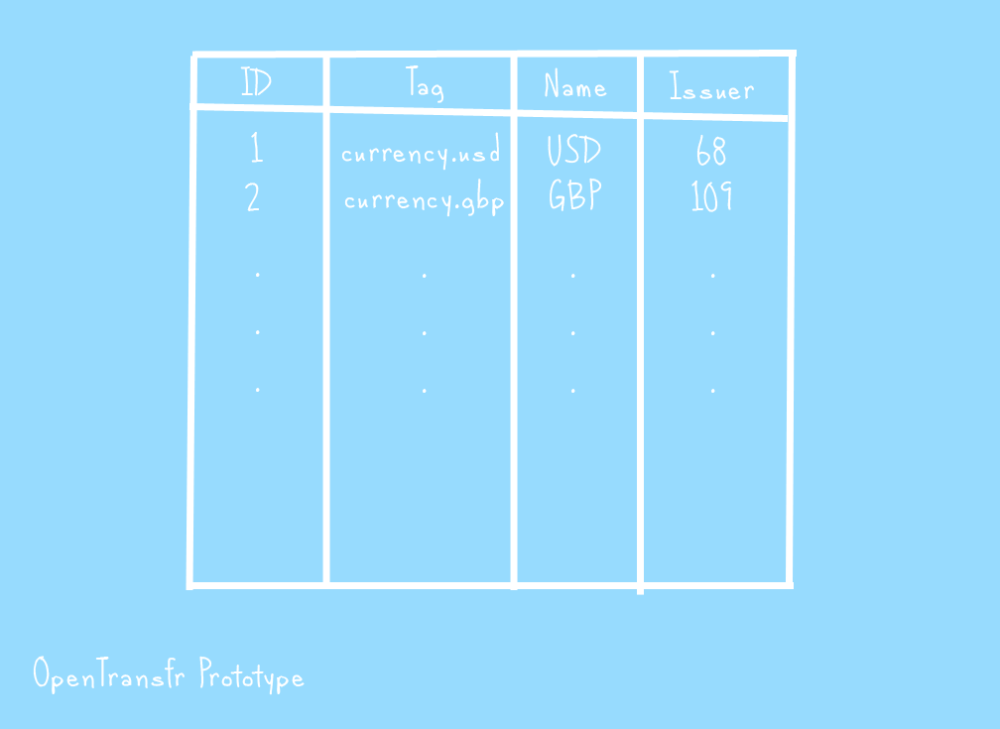

Root nodes store and synchronise a group of tables which hold all the vital information which makes the network tick. Here's the tables and what they contain.

.. _balanceTable:

Balance Table
=============

This table holds a list of all balances on the network.
These balances do not represent individual people's account balances; instead a group of balances are owned by a bank and get shared by all of their accounts.
The information in this table is anonymous and open to all to see. The only information that is exposed is how much total value each bank has which is generally public information at the moment already.

:Address
    Each balance is held in an address. These addresses are the public key of a public/private key pair.
    The private key is stored by the bank that actually holds the balance.
    You have to prove you've got the private key to request a transaction.

:Bank
    The bank that owns a particular balance. The transaction system can work without this column, however, it's designed to protect stolen value in the unlikely event that a bank gets hacked.
    For example, a hacker could steal all of a banks private keys and attempt to add them to another bank.
    Root will reject any transaction requests because the balances belong to another bank.
    As a secondary protection, banks are not allowed to provide any form of private key upload - that prevents someone from stealing the private keys, uploading them all to the same bank they hacked, then transferring all the value out elsewhere.
    
:Balance
    This is the amount of a commodity that a particular address holds. It's an integer value and usually represents e.g. pennies or cents.
    This avoids rounding issues.

:Commodity
    The network is designed to handle a wide range of things that represent value - from ordinary currencies to something more abstract such as a property deed or corporate stock.
    This column tells the network what type of 'thing' a particular balance is. Outside the network, commodities are normally represented with a tag like "currency.gbp".
    The commodity table converts a particular tag to a number which gets held here.

.. _entityTable:

Entity Table
============

The entity table holds recognised organisations and their access level on the network. For example, if you create a new bank, a new entry shows up in this table.

:ID
    A unique number assigned to each entity. This is usually used by the balances table.

:Key
    Just like balances, each entity has a private/public key pair. This is used, along with an SSL certificate, to authorise them on the network.

:Access
    Defines what kind of access level this entity has. Either a root, bank, issuer or none (in order of level).
    Note that an entity which is more than one (e.g. both a root and a bank) uses the higher level here.

:Contact
    Public contact information for this entity. Includes the country which the entity is registered.

:Endpoint
    The endpoint that the bank API can be found at.

.. _commoditiesTable:

Commodities Table
=================

The commodities table holds the information about the available commodities. This is mainly used to convert tags into ID's and validate issue requests (as there can only be one issuer for a commodity).

:ID
    A unique number assigned to a commodity when it gets created (that's when someone declares they want to issue it).

:Tag
    The full tag for the commodity. This is used to group commodities together based on what they represent. Tags are usually used to refer to a particular commodity instead of its ID.

:Name_en
    The English name of the commodity. Note that this column is repeated for a variety of different languages (For example, Name_fr is the French name).

:Issuer
    The ID of the entity in the `entity table`_ which issues this commodity.

Transactions Table
==================

Note that the transactions table in root typically only stores 5 days of transaction history to keep the root lean and fast. Other nodes on the network, history nodes, are intended to track the entire history.

